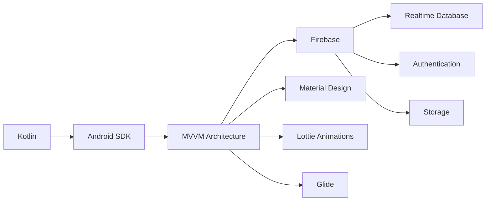
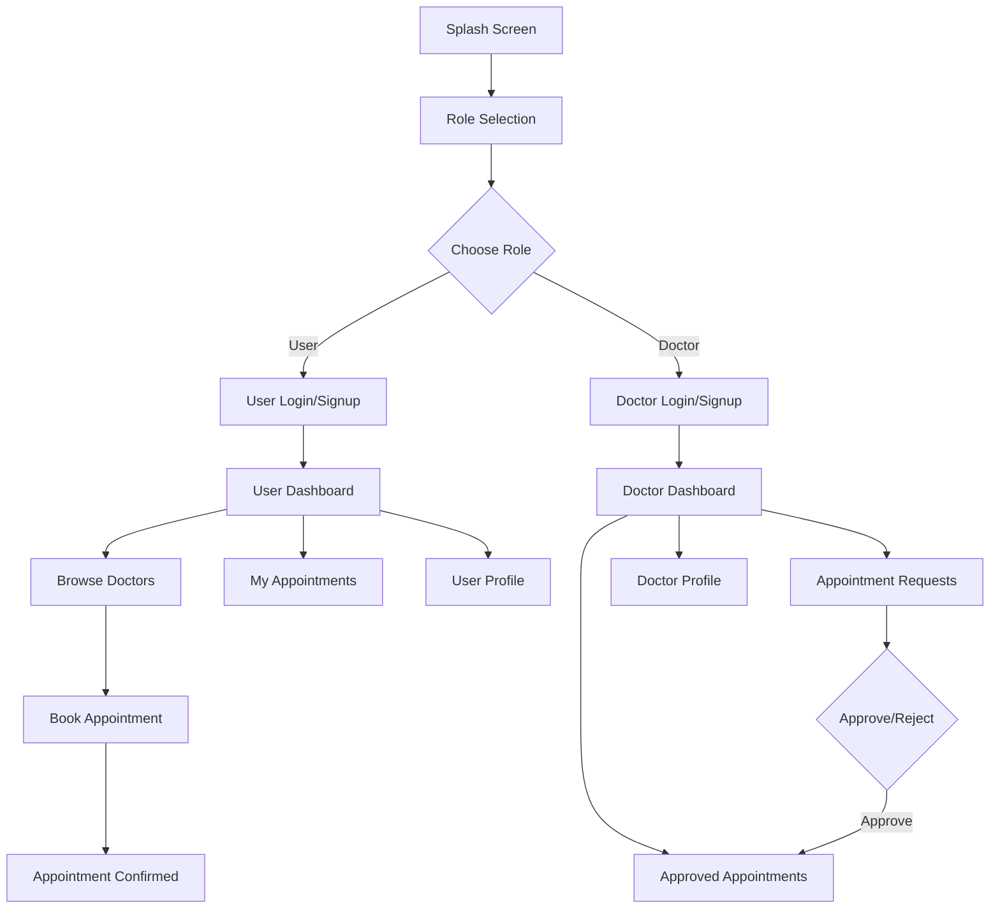

<div align="center">

# 🏥 BookMyHealth


<br/>


<br/>

**A modern healthcare appointment booking Android application built with Kotlin and Firebase**

[](https://github.com/yourusername/BookMyHealth)
[](https://github.com/yourusername/BookMyHealth)

---

[Features](#-features) • [Tech Stack](#-tech-stack) • [Architecture](#-architecture) • [Installation](#-installation) • [Screenshots](#-screenshots) • [Contributing](#-contributing)

</div>

---

## 📱 About

<div align="center">

### 🏥 BookMyHealth App Icon


> App icon available in `app/src/main/mipmap-*/ic_launcher.png`


</div>

**BookMyHealth** is a comprehensive healthcare management application that connects patients with doctors, enabling seamless appointment booking and management. The app features a dual-role system supporting both **Doctors** and **Users (Patients)**, with a beautiful, modern UI powered by Material Design 3 and smooth animations.

<div align="center">


</div>

### Key Highlights
- 🎯 **Dual Role System**: Separate interfaces for Doctors and Patients
- 🔐 **Multiple Authentication**: Email/Password and Google Sign-In
- 📅 **Appointment Management**: Book, view, and manage appointments
- 🔍 **Smart Search & Filter**: Find doctors by specialization, experience, and availability
- 🎨 **Modern UI/UX**: Beautiful animations, Lottie effects, and Material Design
- ☁️ **Cloud-Powered**: Real-time data synchronization with Firebase

---

## ✨ Features

<div align="center">

### 🎯 Core Features Overview


</div>

### 🔐 Authentication & User Management
- **Email/Password Authentication**: Secure registration and login
- **Google Sign-In Integration**: One-tap authentication with Google accounts
- **Role-Based Access**: Separate login flows for Doctors and Users
- **Password Reset**: Forgot password functionality
- **Auto Login**: Persistent session management
- **Profile Management**: Complete profile setup and editing

### 👨‍⚕️ Doctor Features
- **Doctor Dashboard**: View all appointment requests in real-time
- **Appointment Management**: Approve or reject appointment requests
- **Profile Management**: Complete doctor profile with:
  - Specialization, Experience, Clinic Name
  - Consultation Fee, About Section
  - Weekly Availability Schedule
  - Achievements & Awards
  - Profile Image Upload
- **Appointment History**: Track all past and upcoming appointments
- **Search & Filter**: Filter appointments by status, date, patient name

### 👤 User (Patient) Features
- **User Dashboard**: Browse available doctors with beautiful card layouts
- **Doctor Discovery**: 
  - Search doctors by name, specialization
  - Filter by specialization, experience, availability
  - View doctor profiles with complete details
- **Appointment Booking**: 
  - Select date and time slots
  - Book appointments with preferred doctors
  - View appointment status (Pending/Approved/Rejected)
- **My Appointments**: Track all booked appointments
- **Profile Management**: Edit personal information and profile picture

### 🎨 UI/UX Features

<div align="center">


</div>

- **Splash Screen**: Animated app launch with fade effects
- **Intro Sliders**: Beautiful onboarding experience with ViewPager2
- **Lottie Animations**: Smooth, engaging animations throughout the app
  - Doctor role animation (`doctor_role.json`)
  - User role animation (`user_role.json`)
  - Login animation (`login.json`)
  - Doctor profile animation (`doctor_profile_anim.json`)
  - Filter animation (`filter.json`)
  - Empty state animation (`empty.json`)
  - Multiple slide animations for both roles
- **Material Design 3**: Modern, clean interface following Material guidelines
- **Dark Theme Support**: Built-in dark mode support
- **Smooth Animations**: Fade, scale, slide, and bounce animations
- **Custom Toast Messages**: Beautiful, contextual toast notifications
- **Drawer Navigation**: Easy navigation with Material Drawer
- **Pull-to-Refresh**: Refresh data with swipe gesture
- **Empty States**: Friendly empty state illustrations

---

## 🛠 Tech Stack

<div align="center">

### Technology Stack Overview



### Core Technologies


</div>

### Core Technologies
- **Language**:  [Kotlin](https://kotlinlang.org/) **2.0.21**
- **Platform**:  **Android** (API 24 - 35)
- **Build System**:  **Gradle 8.5.0** with Kotlin DSL
- **Architecture**: 🏗️ **MVVM** (Model-View-ViewModel)

### Android Libraries
| Library | Version | Purpose | Logo |
|---------|---------|---------|------|
| **AndroidX Core KTX** | 1.12.0 | Kotlin extensions for Android |  |
| **AndroidX AppCompat** | 1.7.0 | Backward compatibility |  |
| **Material Design** | 1.13.0 | Modern UI components |  |
| **ConstraintLayout** | 2.2.0 | Flexible layout system |  |
| **RecyclerView** | 1.3.2 | Efficient list rendering |  |
| **ViewPager2** | Latest | Intro sliders and carousels |  |
| **Activity KTX** | 1.8.2 | Activity extensions |  |

### Architecture Components
| Component | Version | Purpose | Logo |
|-----------|---------|---------|------|
| **Lifecycle ViewModel** | 2.8.7 | ViewModel for UI data |  |
| **Lifecycle LiveData** | 2.8.7 | Observable data holders |  |
| **ViewBinding** | Built-in | Type-safe view references |  |

### 🔥 Firebase Services
<div align="center">


</div>

| Service | Version | Purpose | Logo |
|---------|---------|---------|------|
| **Firebase BOM** | 34.5.0 | Firebase dependency management |  |
| **Firebase Auth KTX** | 23.2.1 | Authentication (Email/Password, Google) |  |
| **Firebase Realtime Database KTX** | 21.0.0 | Real-time data storage |  |
| **Firebase Storage KTX** | 21.0.2 | Image and file storage |  |

### Third-Party Libraries
<div align="center">


</div>

| Library | Version | Purpose | Logo |
|---------|---------|---------|------|
| **Lottie** | 6.5.0 | Beautiful JSON-based animations |  |
| **Glide** | 4.16.0 | Image loading and caching |  |
| **Google Play Services Auth** | 21.2.0 | Google Sign-In integration |  |
| **Kotlin Coroutines** | 1.8.1 | Asynchronous programming |  |

### Development Tools
- **Kotlin KAPT**: Annotation processing for Glide
- **JUnit 4**: Unit testing
- **Espresso**: UI testing
- **AndroidX Test**: Instrumentation testing

---

## 📱 App Flow

<div align="center">



</div>

---

## 🏗 Architecture

The app follows **MVVM (Model-View-ViewModel)** architecture pattern:

```
┌─────────────────────────────────────────────────────────┐
│                      UI Layer                            │
│  ┌──────────────┐  ┌──────────────┐  ┌──────────────┐  │
│  │  Activities  │  │  Fragments   │  │   Adapters   │  │
│  └──────┬───────┘  └──────┬───────┘  └──────┬───────┘  │
│         │                  │                  │          │
│         └──────────────────┼──────────────────┘          │
│                            │                             │
│                    ┌────────▼────────┐                   │
│                    │   ViewModels    │                   │
│                    │  (LiveData)     │                   │
│                    └────────┬────────┘                   │
└─────────────────────────────┼─────────────────────────────┘
                              │
┌─────────────────────────────┼─────────────────────────────┐
│                    ┌────────▼────────┐                   │
│                    │   Repository    │                   │
│                    │  (Firebase)     │                   │
│                    └────────┬────────┘                   │
│                             │                             │
│                    ┌────────▼────────┐                   │
│                    │   Data Models   │                   │
│                    └─────────────────┘                   │
└───────────────────────────────────────────────────────────┘
                              │
┌─────────────────────────────┼─────────────────────────────┐
│                    ┌────────▼────────┐                   │
│                    │    Firebase     │                   │
│                    │  (Auth, DB,     │                   │
│                    │   Storage)      │                   │
│                    └─────────────────┘                   │
└───────────────────────────────────────────────────────────┘
```

### 📱 Activities & Screens

<div align="center">

#### 🚀 Splash & Onboarding
| Activity | Description |
|:--------:|:-----------|
| `SplashActivity` | Animated splash screen with app logo |
| `LoadingActivity` | Loading screen with animations |
| `RoleSelectActivity` | Role selection (Doctor/User) with intro sliders |

#### 🔐 Authentication Screens
| Activity | Description |
|:--------:|:-----------|
| `UserLoginActivity` | User login with Email/Password & Google Sign-In |
| `UserSignupActivity` | User registration |
| `DoctorLoginActivity` | Doctor login with Email/Password & Google Sign-In |
| `DoctorSignupActivity` | Doctor registration |

#### 👤 User Screens
| Activity | Description |
|:--------:|:-----------|
| `UserDashboardActivity` | Main dashboard with doctor list, search, filters |
| `BookAppointmentActivity` | Book appointment with date/time picker |
| `UserAppointmentsActivity` | View all user appointments |
| `UserProfileActivity` | User profile management |

#### 👨‍⚕️ Doctor Screens
| Activity | Description |
|:--------:|:-----------|
| `DoctorDashboardActivity` | Main dashboard with appointment requests |
| `DoctorApprovedListActivity` | View approved appointments |
| `DoctorProfileActivity` | Doctor profile management with full details |

</div>

### Package Structure
```
com.example.bookmyhealth/
├── adapter/              # RecyclerView & ViewPager adapters
│   ├── AppointmentAdapter.kt
│   ├── DoctorListAdapter.kt
│   ├── IntroAdapter.kt
│   ├── LottieSliderAdapter.kt
│   ├── UserAppointmentAdapter.kt
│   └── UserLottieAdapter.kt
│
├── data/
│   ├── model/           # Data classes
│   │   ├── Appointment.kt
│   │   ├── Doctor.kt
│   │   ├── IntroItem.kt
│   │   ├── SlideItem.kt
│   │   ├── User.kt
│   │   └── UserSlideItem.kt
│   └── repository/      # Data access layer
│       └── FirebaseRepository.kt
│
├── ui/
│   ├── auth/           # Authentication screens
│   │   ├── RoleSelectActivity.kt
│   │   ├── doctor/     # Doctor auth screens
│   │   │   ├── DoctorLoginActivity.kt
│   │   │   ├── DoctorSignupActivity.kt
│   │   │   ├── DoctorDashboardActivity.kt
│   │   │   └── DoctorApprovedListActivity.kt
│   │   └── user/       # User auth screens
│   │       ├── UserLoginActivity.kt
│   │       ├── UserSignupActivity.kt
│   │       ├── UserDashboardActivity.kt
│   │       ├── BookAppointmentActivity.kt
│   │       └── UserAppointmentsActivity.kt
│   ├── profile/        # Profile management
│   │   ├── DoctorProfileActivity.kt
│   │   └── UserProfileActivity.kt
│   └── splash/        # Splash & loading screens
│       ├── LoadingActivity.kt
│       └── SplashActivity.kt
│
├── utils/              # Utility classes
│   └── SuperToast.kt
│
└── viewmodel/          # ViewModels
    ├── AppointmentViewModel.kt
    ├── AuthViewModel.kt
    └── DoctorViewModel.kt
```

---

## 📊 Data Models

<div align="center">

### Core Data Structures

</div>

### 👤 User Model
```kotlin
data class User(
    var uid: String = "",
    var name: String = "",
    var email: String = "",
    var phone: String = "",
    var age: String = "",
    var address: String = "",
    var imageUrl: String = "",
    var role: String = "User"
)
```

### 👨‍⚕️ Doctor Model
```kotlin
data class Doctor(
    var uid: String = "",
    var name: String = "",
    var email: String = "",
    var specialization: String = "",
    var experience: String = "",
    var availableSlots: String = "",
    var imageUrl: String = "",
    var about: String = "",
    var clinicName: String = "",
    var consultationFee: String = "",
    var achievements: String = "",
    var weeklyAvailability: List<String> = listOf(),
    var role: String = "Doctor"
)
```

### 📅 Appointment Model
```kotlin
data class Appointment(
    val appointmentId: String = "",
    val userId: String = "",
    val userName: String = "",
    val doctorId: String = "",
    val doctorName: String = "",
    val date: String = "",
    val time: String = "",
    val slot: String = "",
    val status: String = "Pending"  // Pending, Approved, Rejected
)
```

<div align="center">


</div>

---

## 🎨 Color Scheme

<div align="center">

### Primary Colors


</div>

---

## 📋 Prerequisites

Before you begin, ensure you have the following installed:

- **Android Studio** (Hedgehog | 2023.1.1 or later)
- **JDK 11** or higher
- **Android SDK** (API 24 - 35)
- **Firebase Account** (for backend services)
- **Google Account** (for Google Sign-In setup)

---

## 🚀 Installation

<div align="center">

### ⚡ Quick Start Guide


</div>

> **Note**: Replace `yourusername` in GitHub URLs with your actual GitHub username before using the links.

---

### 1. Clone the Repository

<div align="center">


</div>

```bash
git clone https://github.com/yourusername/BookMyHealth.git
cd BookMyHealth
```

### 2. Firebase Setup

<div align="center">


</div>

#### Create Firebase Project

<div align="center">

[](https://console.firebase.google.com/)

</div>

1. Go to [Firebase Console](https://console.firebase.google.com/)
2. Create a new project or use existing one
3. Enable the following services:

<div align="center">


</div>

   - **Authentication** (Email/Password & Google Sign-In)
   - **Realtime Database**
   - **Storage**

#### Configure Google Sign-In
1. In Firebase Console → Authentication → Sign-in method
2. Enable **Google** sign-in provider
3. Add your app's SHA-1 fingerprint:
   ```bash
   keytool -list -v -keystore ~/.android/debug.keystore -alias androiddebugkey -storepass android -keypass android
   ```

#### Add Firebase Configuration
1. Download `google-services.json` from Firebase Console
2. Place it in `app/` directory

#### Configure Realtime Database
1. Go to Firebase Console → Realtime Database
2. Create database in **Asia-Southeast1** region (or update URL in code)
3. Set rules:
   ```json
   {
     "rules": {
       "users": {
         ".read": "auth != null",
         ".write": "auth != null"
       },
       "doctors": {
         ".read": true,
         ".write": "auth != null"
       },
       "appointments": {
         ".read": "auth != null",
         ".write": "auth != null"
       }
     }
   }
   ```

### 3. Update Google Sign-In Configuration
Update the Web Client ID in `app/src/main/res/values/strings.xml`:
```xml
<string name="default_web_client_id">
    YOUR_WEB_CLIENT_ID_HERE
</string>
```

### 4. Build and Run
```bash
# Using Gradle Wrapper
./gradlew assembleDebug

# Or open in Android Studio and click Run
```

---

## 📸 Screenshots

<div align="center">

### 🚀 Splash & Onboarding

| Splash Screen | Role Selection | Intro Slider |
|:---:|:---:|:---:|
|  |  |  |

### 🔐 Authentication

| User Login | User Signup | Doctor Login | Doctor Signup |
|:---:|:---:|:---:|:---:|
|  |  |  |  |

### 👤 User Features

| User Dashboard | Doctor List | Search & Filter | Book Appointment |
|:---:|:---:|:---:|:---:|
|  |  |  |  |

| Doctor Profile | My Appointments | User Profile |
|:---:|:---:|:---:|
|  |  |  |

### 👨‍⚕️ Doctor Features

| Doctor Dashboard | Appointment Requests | Approve/Reject | Approved List |
|:---:|:---:|:---:|:---:|
|  |  |  |  |

| Doctor Profile | Profile Management |
|:---:|:---:|
|  |  |

> **Note**: Replace placeholder images with actual screenshots from your app for better presentation.

</div>

---

## 🔧 Configuration

### Firebase Database URL
The app uses a regional Firebase Realtime Database. Update the URL in:
- `FirebaseRepository.kt`
- `SplashActivity.kt`
- `DoctorDashboardActivity.kt`
- `UserDashboardActivity.kt`

Current URL: `https://bookmyhealth-5920a-default-rtdb.asia-southeast1.firebasedatabase.app/`

### Build Configuration
- **Min SDK**: 24 (Android 7.0)
- **Target SDK**: 35 (Android 15)
- **Compile SDK**: 35
- **Version Code**: 1
- **Version Name**: 1.0

---

## 🎯 Key Features Implementation

### Authentication Flow
```kotlin
// Email/Password Registration
FirebaseRepository.registerUser(name, email, password, role) { success, message ->
    // Handle result
}

// Google Sign-In
FirebaseRepository.signInWithGoogleIdToken(idToken, role) { success, message ->
    // Handle result
}
```

### Real-time Data Sync
```kotlin
// Listen to appointment changes
database.child("appointments")
    .orderByChild("doctorId")
    .equalTo(doctorId)
    .addValueEventListener { snapshot ->
        // Update UI in real-time
    }
```

### Image Loading
```kotlin
// Glide for profile images
Glide.with(context)
    .load(imageUrl)
    .placeholder(R.drawable.placeholder)
    .into(imageView)
```

---

## 🧪 Testing

### Unit Tests
```bash
./gradlew test
```

### Instrumented Tests
```bash
./gradlew connectedAndroidTest
```

---

## 📦 Dependencies

All dependencies are managed through:
- **Gradle Version Catalog** (`gradle/libs.versions.toml`)
- **Firebase BOM** (for version consistency)

See `app/build.gradle.kts` for complete dependency list.

---

## 🤝 Contributing

Contributions are welcome! Please follow these steps:

1. Fork the repository
2. Create a feature branch (`git checkout -b feature/AmazingFeature`)
3. Commit your changes (`git commit -m 'Add some AmazingFeature'`)
4. Push to the branch (`git push origin feature/AmazingFeature`)
5. Open a Pull Request

### Code Style
- Follow Kotlin coding conventions
- Use meaningful variable and function names
- Add comments for complex logic
- Maintain MVVM architecture pattern

---

## 📄 License

This project is licensed under the MIT License - see the [LICENSE](LICENSE) file for details.

---

## 👨‍💻 Author

**Your Name**
- GitHub: [@yourusername](https://github.com/yourusername)
- Email: your.email@example.com

---

## 🙏 Acknowledgments

<div align="center">

### Special Thanks to These Amazing Technologies & Libraries

<table>
<tr>
<td align="center">
<a href="https://firebase.google.com/">

</a>
<br/>
Backend Services
</td>
<td align="center">
<a href="https://lottiefiles.com/">

</a>
<br/>
Beautiful Animations
</td>
</tr>
<tr>
<td align="center">
<a href="https://material.io/">

</a>
<br/>
Design Guidelines
</td>
<td align="center">
<a href="https://github.com/bumptech/glide">

</a>
<br/>
Image Loading
</td>
</tr>
</table>

</div>

### Libraries & Tools Used

<div align="center">

[](https://firebase.google.com/)
[](https://lottiefiles.com/)
[](https://material.io/)
[](https://github.com/bumptech/glide)
[](https://kotlinlang.org/)
[](https://developer.android.com/)

</div>

---

## 📞 Support

If you have any questions or need help, please:
- Open an [Issue](https://github.com/yourusername/BookMyHealth/issues)
- Contact: your.email@example.com

---

<div align="center">

## 🌟 Show Your Support

**Made with ❤️ using Kotlin and Firebase**

<div>


</div>

---

### ⭐ Star this repo if you find it helpful!

[](https://github.com/yourusername/BookMyHealth)
[](https://github.com/yourusername/BookMyHealth)
[](https://github.com/yourusername/BookMyHealth)

---

<div align="center">

### 📊 Project Statistics


</div>

---

<div align="center">

### 🏆 Featured On

[](https://github.com/yourusername/BookMyHealth)
[](https://play.google.com/store/apps)

</div>

---

**BookMyHealth** - Your Complete Healthcare Solution 🏥

</div>

